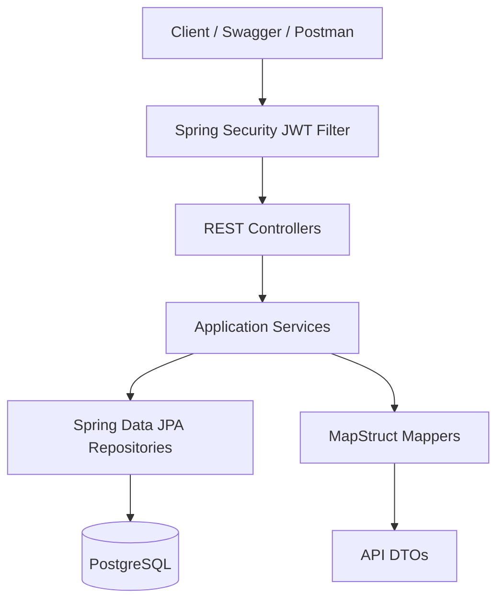
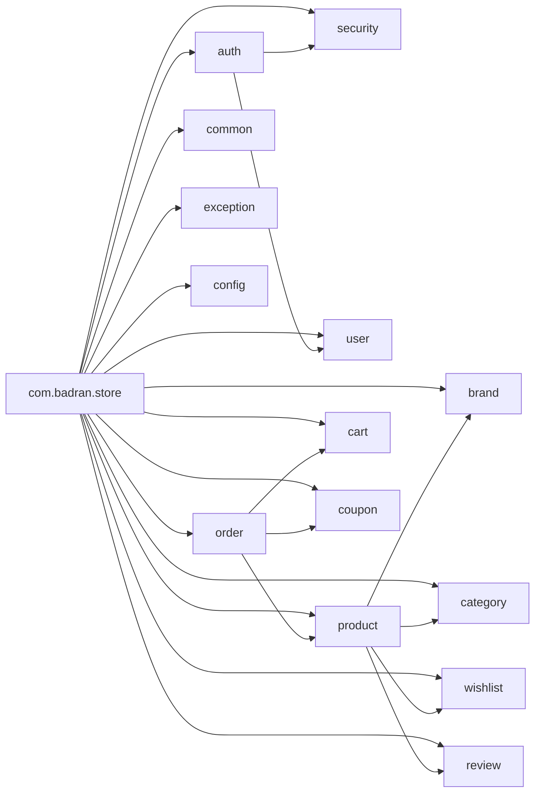
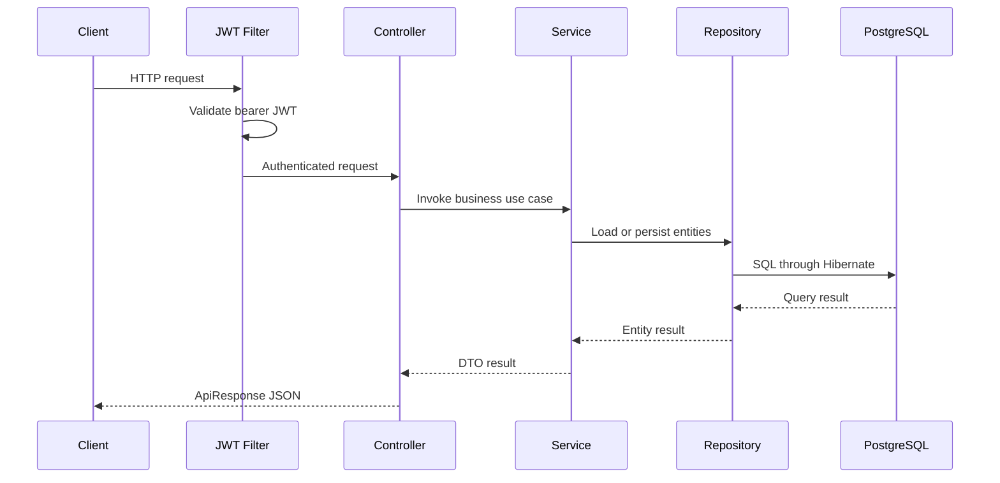

# Architecture

Badran Store is a Spring Boot modular monolith. It runs as one deployable application while keeping business capabilities separated into packages under `com.badran.store`.

## Runtime View

## Module View

## Request Flow

Standalone Mermaid files are available under `docs/mermaid/`.
