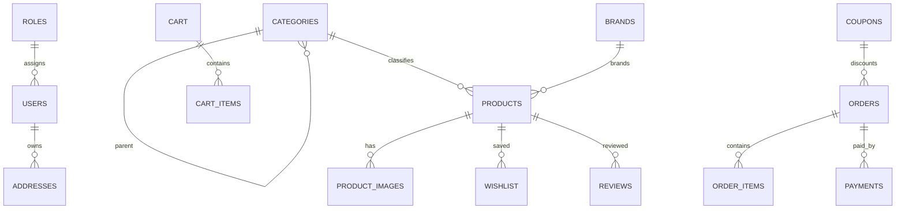

# Database

The application uses PostgreSQL with Hibernate validation mode. Runtime table generation is disabled, so the schema must exist before startup.

## Initialization

```bash
createdb badran_store
psql -d badran_store -f sql/init.sql
```

## ER Diagram



## Important Tables

- `roles`, `users`, `addresses`
- `brands`, `categories`, `products`, `product_images`
- `cart`, `cart_items`
- `coupons`, `orders`, `order_items`, `payments`
- `reviews`, `wishlist`

## JSONB Columns

- `roles.permissions`
- `products.specifications`

## Validation Mode

```yaml
spring:
  jpa:
    hibernate:
      ddl-auto: validate
```
